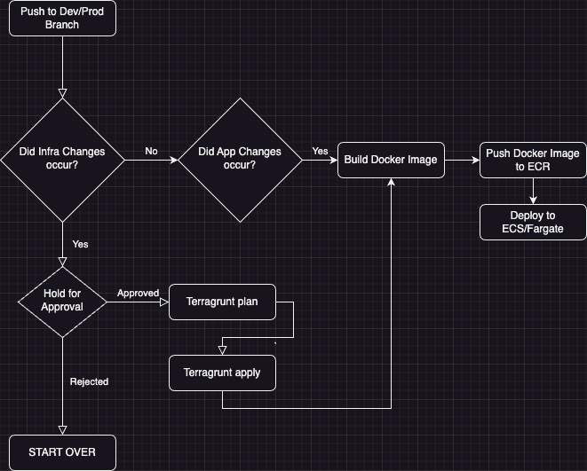

# Take Home Infrastructure Project
## URL: http://dev-alb-1591090632.us-west-2.elb.amazonaws.com/
## Project Objective:
##### The chief objective of this project centered around the efficient deployment of a performance-centric Wordpress site onto ECS/EKS utilizing Terraform. Whilst speed was a pivotal point, there were several other key considerations that I aimed to holistically incorporate within this undertaking, including:
- Experimenting with Terragrunt for efficient Terraform management.
- Crafting infrastructure that facilitates scalability, ensuring seamless capacity adjustments in response to dynamic needs.
- Constructing a high-availability setup resilient against server failures for non-disjoint service.
- Employing OPCache for PHP optimization by storing precompiled script bytecode into shared memory, eliminating the need for repetitive script loading and interpretation for each request.
- Utilizing Amazon EFS to establish a scalable, secure shared storage platform for Wordpress data, accessible by Fargate tasks across different Availability Zones enabling high system availability and resilience.
- Routing traffic via an Application Load Balancer (ALB) to disparate Fargate tasks located in separate Availability Zones.
- Conforming to industry best practices for robust networking and securing protocols.
- Utilizing SSM for well-coordinated secrets management.
- Orchestrating a streamlined continuous integration/continuous deployment (CI/CD) process through Github Actions.
- Efficient deployment and connection of a whitelist database, tailored for exclusive accessibility by the ECS Service.
- Engineering a CI/CD pipeline imbued with conditional logic for dynamic run scenarios, allowing infrastructure provisioning and/or CI/CD as the situation demands.
- My aim extended beyond simply setting up a swift Wordpress site but more into the seams of creating a reliable, secure, and scalable infrastructure incorporating industry best practices and catering for different real-world deployment situations.

## Architecture Diagram
### Ignore the database in this diagram, Our database is connected to both tasks using seperate ENI's.

## CI/CD Pipeline
- The CI/CD Pipeline capitalizes on a tailor-made Python script to scrutinize the details of the commit, enabling it to make adaptive decisions contingent on the identified changes.
- A Custom solution was implemented in order handle the manual approval process via Github Issues.  
- Sample Deployment Approval Issue(https://github.com/adwait1290/take-home-infrastructure-project/issues/1)
- Sample CI Run(https://github.com/adwait1290/take-home-infrastructure-project/actions/runs/5451273627)
- Note: In the CI Run above, Only Infrastructure changes were detected so the Container Build process was skipped as intended.

## Modules and Resource List

#### alb
- Local Common Tags: It provides a way to define common tags for resource identification and environment isolation. It's a best-practice recommendation for efficient resource management.
- AWS Load Balancer (main): It represents an internet-facing application Load Balancer that spans across certain subnets. Its details include a meaningful name derived by prepending the environment name, security groups and deletion protection.
- AWS Target Group (tg): This serves as a target for the Load Balancer. It features easy identification via prepended tags, health check configuration, and lifecycle rules to ignore certain changes.
- AWS Load Balancer Listener (http2): This sets up a listener for HTTP traffic on port 8080 and forwards the traffic to the targeted group.
- AWS Load Balancer Listener (http1): Similar to the http2 listener, but this listens for HTTP traffic on port 80. (Should ideally only pick one)
- AWS Load Balancer Listener (https_redirect): This caters to HTTPS traffic on port 443. It's associated with a certain SSL policy and a certificate for HTTPS. Similar to the HTTP listeners, it also forwards the traffic to the target group.

#### ecr
- Local Common Tags: It defines common tags for resource identification and environment isolation. This helps in efficient resource management and is a best-practices recommendation.
- ECR Repository (repository): This resource creates a new ECR repository whose name is a combination of the project name and environment. It allows for mutable image tags, meaning image tags can be overwritten. An automatic scan is triggered on every image push to discover vulnerabilities in Docker images.
- ECR Lifecycle Policy (policy): This policy is linked to the newly-created ECR repository. It automatically cleans up images older than 14 days. It's a good practice to prevent bloating the repository with outdated images.

#### efs
- Local Common Tags: It offers a uniform way to label resources, enabling easier identification and environment isolation. It is recommended for efficient resource management.
- Random Password (db_password): A 16-character long password, devoid of special characters, is generated randomly for the database. This enhances security by preventing the use of predictable or reusable passwords.
- Key Management Service (KMS) (wordpress): This resource generates a new KMS key for encrypting Wordpress-related resources. Features include a deletion delay of seven days, key rotation, and tag application.
- KMS Alias (wordpress): A user-friendly alias is created for the KMS key, allowing easy accessibility.
- Elastic File System (wordpress): An elastic file system is created to store Wordpress Data. The system is high-performance and scalable, with added security from the associated KMS key and encryption.
- EFS Mount Target (wordpress): Mount targets are created for the EFS in designated subnets. The number of targets depends on the count of subnets provided.
- EFS Access Points (wordpress_plugins): An access point is specifically created for the "plugins" directory. It offers precise control over owner UID and GID, along with permissions.
- EFS Access Points (wordpress_themes): Another access point is defined exclusively for the "themes" directory. It shares identical ownership details and permissions with the "plugins" directory but provides better organization.

#### fargate
- AWS SSM Parameters: Fetches parameters securely stored in AWS Systems Manager Parameter Store. The parameters include database password, host, username, and name. The parameter values are returned in a decrypted format for usage.
- AWS Region: Retrieves the current AWS region to potentially deploy resources in the same region.
- AWS Caller Identity: Fetches the details of the current AWS caller to determine the AWS Account ID.
- IAM Policy Document (kms): Creates a broad IAM policy that grants all KMS actions for the root user, as well as specific actions for Cloudwatch Logs service. It's a best practice to limit the permissions to those necessary only.
- ECS Task Trust Policy: Allows ECS Tasks to assume a role, leveraging the AWS Identity and Access Management service.
- ECS Task Policy: Defines the necessary access required for the ECS tasks to interact with various AWS services, fetch secret values from Secrets Manager, and decrypt using the KMS key.
- IAM Policy (ecs): Fetches the built-in "AmazonECS_FullAccess" policy. It grants ECS tasks all necessary permissions.
- IAM Policy (ecr): Fetches the built-in "AmazonEC2ContainerRegistryFullAccess" policy, granting ECS tasks necessary permissions to interact with the Elastic Container Registry.

#### rds
- Local Common Tags: Consistent tags are defined for easy resource identification and environment isolation, aiding efficient resource management.
- AWS DB Instance (default): It creates and manages an AWS DB instance with configured storage, engine type/version, instance class, database name, username/password, parameter group, security group, availability zones, public accessibility, snapshot preference, and subnet group.
- AWS DB Subnet Group (default): This resource creates a DB subnet group providing a name and list of subnet IDs for placing the RDS instance.
- AWS DB Parameter Group (default): It manages the DB engine configuration parameters. The database family is set to mariadb10.6, and an initial parameter, max_allowed_packet, is defined for usage.

### security_groups
- Local Common Tags: Common tags are defined for efficient resource management and easy identification.
- EFS Service Security Group (efs_service): This resource creates a security group for EFS Service, which acts as a virtual firewall controlling inbound and outbound traffic.
- EFS Service Ingress NFS TCP Rule (efs_service_ingress_nfs_tcp): It permits inbound traffic from the ECS service over port 2049 enabling communication between ECS and EFS.
- ALB Security Group (alb): This resource creates a security group 'ALB' with defined rules for inbound and outbound traffic. It secures the load balancer over necessary ports. One port should be chosen between 80 and 8080.
- ECS Service Security Group (ecs_service): ECS Service security group resource is created with an egress rule allowing all outbound traffic for instances to communicate with each other.
- ECS Service Ingress HTTP Rules (ecs_service_ingress_http, ecs_service_ingress_https): This allows incoming HTTP and HTTPS traffic from the ALB to ECS service.
- ECS Service Egress Rules (ecs_service_egress_mysql, ecs_service_egress_efs_tcp): These allow outbound MySQL and EFS traffic, facilitating communication with RDS and EFS, respectively.
- RDS Security Group (rds_sg): This security group controls inbound traffic for MySQL RDS over port 3306 from the ECS service and defines an egress rule to control how RDS communicates with other services within AWS.

### ssm
- Local Common Tags: Common tags defined for easy resource identification and environment isolation.
- AWS SSM Parameter (db_username, db_password, db_host, db_name): These resources securely store the database username, password, host and name respectively in AWS SSM Parameter Store. This secure storage of sensitive data is more secure and advisable than hardcoding the details in code.
- Secrets Manager Resource (wordpress): This resource creates a Secure Manager Secret for the Wordpress credentials, providing another layer of security for sensitive data. It also enables rotation and audit capabilities for the stored secrets.
- Secret Version Resource (wordpress): This resource creates an AWS Secrets Manager Secret Version for the Wordpress credentials. This means updates to these credentials will create new versions of the secrets rather than overwriting the previous version, enabling rollback and accountability.

### vpc
- Local Common Tags: Common tags are defined for easier resource identification and environment isolation, assisting in better management.
- AWS Availability Zones (available): This gets the details of the availability zones that are currently available in the region.
- AWS VPC (main): This resource creates a VPC with DNS support and DNS hostname resolution enabled.
- Internet Gateway (gw): An Internet Gateway is created to give the VPC access to the internet.
- Public Subnets (public): Two public subnets are created in the VPC for services like frontend webservers that need to accept incoming traffic.
- Private Subnets (private): Two private subnets are also created for backend servers that don't necessarily need to accept incoming traffic.
- NAT Gateway (main): A NAT gateway is created for outbound internet access for the private subnet.
- Elastic IP (for_nat): An Elastic IP is provisioned for the NAT gateway.
- Route Table for Public Subnets (public): This route table handles the routing of traffic from the public subnets out through the internet gateway.
- Route Table for Private Subnets (private): This route table controls the routing of traffic from the private subnets out through the NAT gateway.

